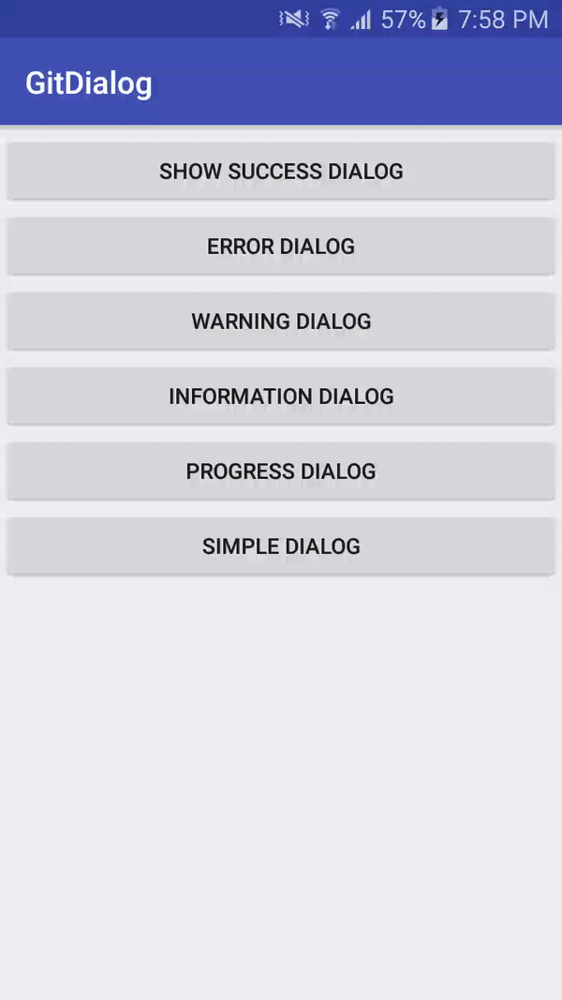

# GitDialog
It's a custom dialog with animation and more accessbilities than general


[](https://jitpack.io/#JPsurj1a01/GitDialog)


For implementing this library in your project just implement the below changes :- 

**Step 1.** Add the JitPack repository to your build file

Add it in your root build.gradle at the end of repositories:

	allprojects {
		repositories {
			...
			maven { url 'https://jitpack.io' }
		}
	}
  
 **Step 2.** Add the dependency

	dependencies {
	           compile 'com.github.JPsurj1a01:GitDialog:-SNAPSHOT'
	}
  
  
  
  **Checkout a demo below how it looks after implementation:** 
    
  
  
  For a dialog implement below code which can be modified by the user accordingly.
  
 > Success Dialog 
```
 GitDialog sampleAlertDialog = new GitDialog(LaunchActivity.this, GitDialog.SUCCESS_TYPE)
                        .setTitle("Success!")
                        .setContentText("This is the demo content to view under the dialog.User can change the dialog content accordingly and manage the several properties like text color,text font style.")
                        .setAnimationTrue(true)
                        .setBackgroundColor(R.color.md_light_green_300);
                sampleAlertDialog.show();
```	
> Error Dialog 
```
  GitDialog sampleAlertDialog = new GitDialog(LaunchActivity.this, GitDialog.ERROR_TYPE)
                        .setTitle("Error!")
                        .setContentText("This is the demo content to view under the dialog.User can change the dialog content accordingly and manage the several properties like text color,text font style.")
                        .setAnimationTrue(true)
                        .setBackgroundColor(R.color.md_deep_orange_600)
                        .setTitleColor(R.color.colorWhite)
                        .showCancelButton(true)
                        .setOnDialogCancelClickListener(new GitDialog.OnShowDialogClickListener() {
                            @Override
                            public void onClick(GitDialog showDialog) {
                                showDialog.dismiss();
                                new GitDialog(LaunchActivity.this, GitDialog.INFORMATION_TYPE)
                                        .setTitle("Information!")
                                        .setContentText("Deleting the Item is cancelled now !")
                                        .setAnimationTrue(true).show();
                            }
                        })
                        .setOnDilaogConfirmClickListener(new GitDialog.OnShowDialogClickListener() {
                            @Override
                            public void onClick(GitDialog showDialog) {
                                showDialog.dismiss();
                                new GitDialog(LaunchActivity.this, GitDialog.SUCCESS_TYPE)
                                        .setTitle("Success!")
                                        .setContentText("The Item Deleted Successfully !")
                                        .setAnimationTrue(true).show();
                            }
                        });
                sampleAlertDialog.show();
```		
> Warning Dialog 
```
 GitDialog sampleAlertDialog = new GitDialog(LaunchActivity.this, GitDialog.WARNING_TYPE)
                        .setTitle("Warning!")
                        .setContentText("This is the demo content to view under the dialog.User can change the dialog content accordingly and manage the several properties like text color,text font style.")
                        .setAnimationTrue(true)
                        .setBackgroundColor(R.color.md_amber_300)
                        .setTitleColor(R.color.colorWhite);
                sampleAlertDialog.show();
```		
  
  
> Progress Dialog
```
  final GitDialog sampleAlertDialog = new GitDialog(LaunchActivity.this, GitDialog.LOADER_TYPE)
                        .setBackgroundColor(R.color.white)
                        .setTitle("Loading please wait...")
                        .setTitleColor(R.color.colorBlack)
                        .setProgressBarColor(R.color.colorPrimary);
                sampleAlertDialog.setCancelable(true);
                sampleAlertDialog.show();

                //this timer is used for demo pupose of running an service and showing the progress dialog
                new CountDownTimer(10000, 1000) {
                    public void onTick(long millisUntilFinished) {

                    }

                    public void onFinish() {
                        sampleAlertDialog.dismiss();
                    }
                }.start();
```		
Try it out !		
